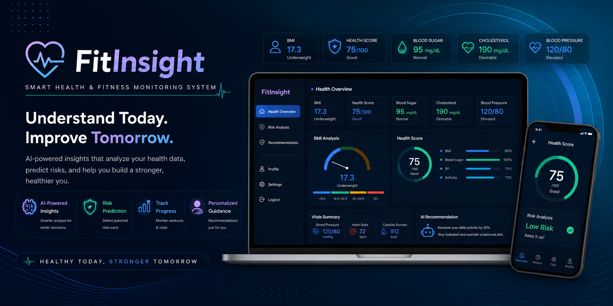
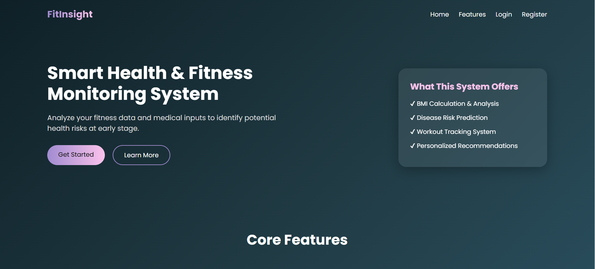
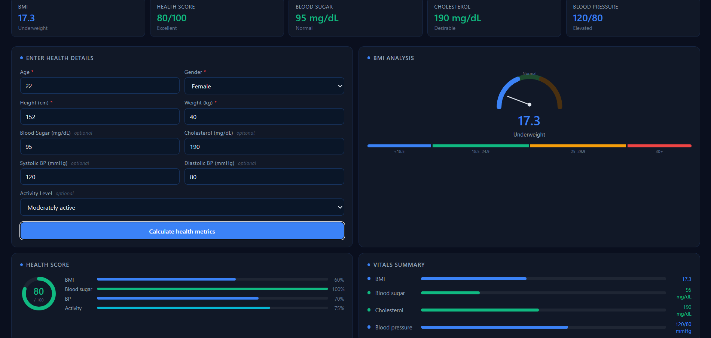
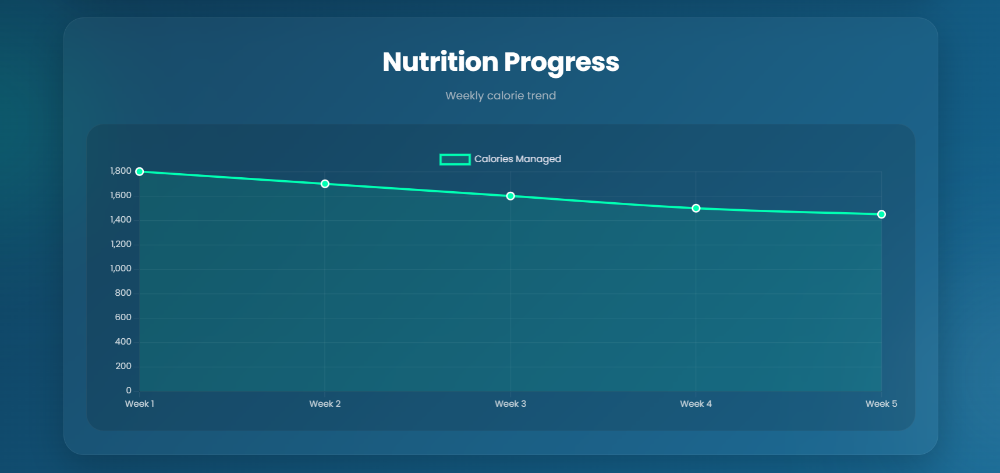
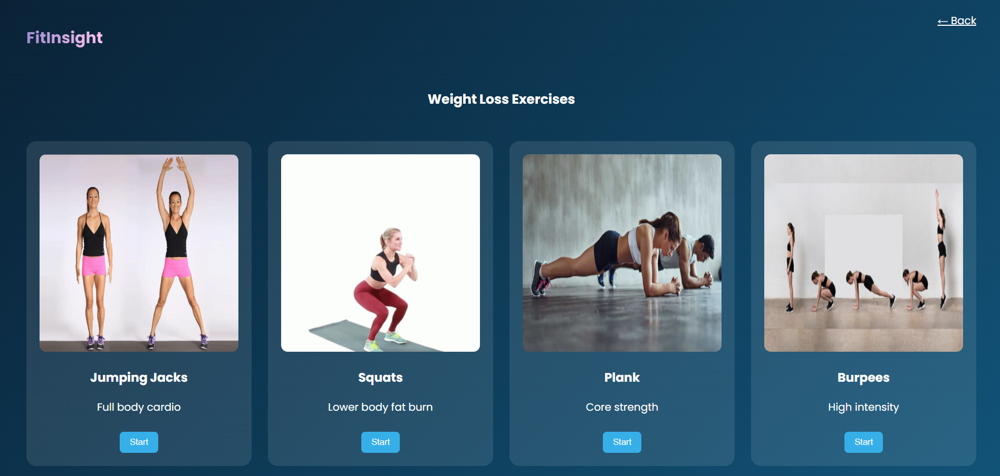

div align="center">

<h1>🏋️‍♀️ FitInsight</h1>

<h3>Smart Health & Fitness Monitoring System</h3>

 

<h2 align="center">🛠 Tech Stack</h2>

## ✨ Features

🔐 User Authentication

🏃 Workout Tracking

🧘 Yoga Management

🥗 Diet Planning

❤️ Health Assessment

📊 BMI Analysis

⚠️ Risk Analysis

📋 Vitals Summary

🤖 AI Recommendations

📈 Progress Analytics

<h2 align="center">👥 Team Members</h2>

<table align="center">
<tr>

<td align="center">
 
<b>Nandni Singh</b> 
Project Lead
</td>

<td align="center">
 
<b>Member 2</b> 
Frontend
</td>

<td align="center">
 
<b>Member 3</b> 
Database
</td>

</tr>
</table>

<h2 align="center">📸 Project Screenshots</h2>

<h2 align="center">📊 Repository Statistics</h2>

 

## 🏆 Contributors

Thanks to all contributors who helped build FitInsight.

### ⭐ If you like this project, don't forget to star the repository!

Made with ❤️ by Team FitInsight

